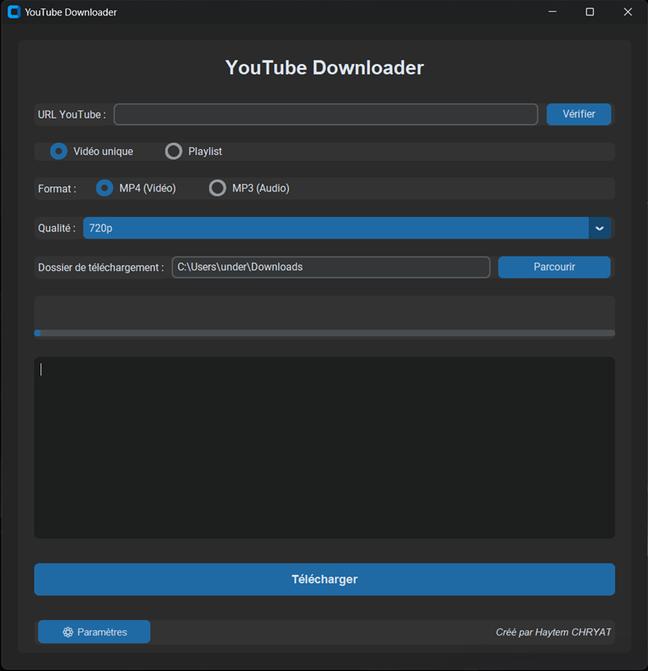

# 🎵 YouTube Downloader

Un téléchargeur YouTube simple, rapide et sans publicité, doté d'une interface graphique moderne. Développé en Python avec **CustomTkinter** et **yt-dlp**.

## ✨ Fonctionnalités

- 🎬 **Téléchargement Vidéo** : Supporte la Haute Définition (720p, 1080p, 4K...) grâce à `yt-dlp`.
- 🎵 **Téléchargement Audio** : Conversion automatique en MP3.
- 📋 **Support des Playlists** : Téléchargez toute une liste de lecture en un clic.
- ⚙️ **Interface Moderne** : Thème sombre (Dark Mode) et UX soignée.
- 🚀 **Performance** : Utilisation de `yt-dlp` pour une fiabilité maximale.

## 🚀 Installation

### Prérequis
- **Python 3.10** ou supérieur
- **FFmpeg** (Fortement recommandé pour la fusion audio/vidéo et la conversion MP3)

### Étapes d'installation

1. **Cloner le projet**
   git clone https://github.com/haytemchr/Youtube-Downloader.git
   cd Youtube-Downloader

2. **Installer les dépendances**
   pip install -r requirements.txt

3. **Lancer l'application**
   python youtube_downloader.py

---

## ⚙️ Configuration (FFmpeg & API)

### 1. FFmpeg (Essentiel pour la qualité)
Pour télécharger en **1080p+** ou convertir en **MP3**, le logiciel a besoin de FFmpeg.
1. Téléchargez FFmpeg (version "essentials") sur [ffmpeg.org](https://ffmpeg.org/download.html).
2. Décompressez le dossier.
3. Dans l'application, allez dans **Paramètres** et indiquez le chemin du dossier `bin` (ex: `C:\\ffmpeg\\bin`).

### 2. Clé API YouTube (Optionnelle)
- **Vidéos uniques** : Pas besoin de clé.
- **Playlists** : La clé est recommandée pour charger les playlists plus rapidement et éviter les blocages, mais le logiciel peut fonctionner sans (en mode scraping).

**Comment obtenir une clé (si besoin) :**
1. Allez sur [Google Cloud Console](https://console.cloud.google.com/).
2. Activez l'API **YouTube Data v3**.
3. Copiez la clé API et collez-la dans les **Paramètres** de l'application.

---

## 📖 Utilisation

1. **Collez l'URL** d'une vidéo ou d'une playlist.
2. Cliquez sur **Vérifier** pour voir les qualités disponibles.
3. Choisissez **Vidéo (MP4)** ou **Audio (MP3)**.
4. Sélectionnez la **Qualité** et le **Dossier de destination**.
5. Cliquez sur **Télécharger** et profitez !

## 🛠️ Stack Technique

- **Langage** : Python 🐍
- **GUI** : CustomTkinter
- **Moteur** : yt-dlp (fork de youtube-dl)
- **API** : YouTube Data API v3 (via Requests)

## 🐛 Dépannage

- **Erreur de fusion / Qualité faible ?**
  Vérifiez que vous avez bien installé FFmpeg et configuré le chemin dans les paramètres.
- **Le téléchargement ne démarre pas ?**
  Vérifiez votre connexion internet et que l'URL est valide (publique).

## 📝 Licence

Ce projet est sous licence MIT. Voir le fichier `LICENSE` pour plus de détails.

## 👨‍💻 Auteur

Créé par **Haytem CHRYAT**.
N'hésitez pas à laisser une ⭐ sur le repo si le projet vous plaît !
